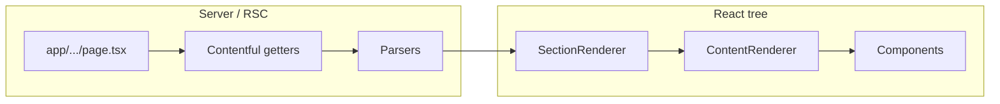

# Architecture

If you are new here, this page is your map. It explains how the site is structured, which technologies we rely on, and how a request goes from the App Router through Contentful data to UI. Automation and teammates can use the same mental model when searching the tree.

## Tech stack

- **Framework**: Next.js 16 with the **App Router**. Routes live under `src/app/` (`page.tsx`, `layout.tsx`, Route Handlers under `src/app/api/`).
- **UI**: React 19, TypeScript.
- **CMS**: Contentful. Content types are generated into `src/contentful/types/`; getters and parsers live in `src/contentful/`.
- **Data fetching**: Server Components and Contentful getters at request/build time; **React Query** (TanStack) for client-side mutations and any future client queries. Mutation hooks live in `src/hooks/mutations/` and call the API surface in [src/api/urls.ts](../../src/api/urls.ts).
- **Styling**: **CSS Modules** (`.module.css`) with modern CSS (nesting, custom properties). Global tokens and reset live in [src/styles/globals.css](../../src/styles/globals.css).
- **Tooling**: pnpm, Biome for lint and format, Jest for tests (page-object pattern when component tests are added).

## Directory map

### `src/app/`

Next.js App Router entrypoints.

- **`layout.tsx`** — Root layout: fonts, global CSS, `Providers`, navigation, footer, draft-mode UI, analytics when configured.
- **`page.tsx`** — Home and top-level routes; nested folders define segments (e.g. `work/[slug]/page.tsx`, `[slug]/page.tsx` for CMS pages).
- **`api/**/route.ts`** — Route Handlers (contact email, HubSpot, draft mode, Vercel hooks, etc.).

### `src/components/`

One folder per feature component under `src/components/<ComponentName>/`. Layout and naming are described in [components.md](components.md).

Structural pieces:

- **[SectionRenderer.component.tsx](../../src/components/SectionRenderer/SectionRenderer.component.tsx)** — Maps `sections` from parsed page data; renders **Section** and **ContentRenderer** for each block.
- **[ContentRenderer.component.tsx](../../src/components/ContentRenderer/ContentRenderer.component.tsx)** — Dispatches on Contentful content type and runs the matching parser before rendering the React component.

### `src/contentful/`

- **Client**: [src/contentful/client.ts](../../src/contentful/client.ts) — delivery vs preview clients from env.
- **Getters**: e.g. [getPages.ts](../../src/contentful/getPages.ts), [getNavigation.ts](../../src/contentful/getNavigation.ts), [getGlobalVariables.ts](../../src/contentful/getGlobalVariables.ts), [getWork.ts](../../src/contentful/getWork.ts).
- **Parsers**: `parse*.ts` normalize entries into app types.
- **Types**: `src/contentful/types/` — generated; run `pnpm types:contentful`.

See [contentful.md](contentful.md).

### `src/hooks/`

Custom hooks; **mutations** under `src/hooks/mutations/` use React Query and `src/api/urls.ts`. Current examples: [useSubmitContactFormMutation.ts](../../src/hooks/mutations/useSubmitContactFormMutation.ts) (contact form), [useDeployHookMutation.ts](../../src/hooks/mutations/useDeployHookMutation.ts) (deploy button). Add **`src/hooks/queries/`** when you introduce client-side queries (see [conventions.md](conventions.md)).

### `src/api/`

- **[urls.ts](../../src/api/urls.ts)** — `api` object for client-side calls to same-origin Route Handlers.
- **[helpers.ts](../../src/api/helpers.ts)** — `postJson`, `fetchResponse`, `FetchMethods`.

### `src/lib/`

Server-oriented helpers such as [generateSitemap.ts](../../src/lib/generateSitemap.ts) and [schema.ts](../../src/lib/schema.ts). See [distribution.md](distribution.md) and [integrations.md](integrations.md).

### `src/utils/`

Shared helpers and [constants.ts](../../src/utils/constants.ts) for slugs and navigation IDs. See [source-layout.md](source-layout.md).

### `src/interfaces/`

Feature-scoped TypeScript interfaces shared across components.

### `src/tests/`

- [basePageObject.po.ts](../../src/tests/basePageObject.po.ts) — base class for page objects.
- [test-utils.tsx](../../src/tests/test-utils.tsx) — custom `render` with app providers; re-exports `userEvent`.
- [factories/BaseFactory.ts](../../src/tests/factories/BaseFactory.ts) — base class for Faker test factories.
- `mocks/` — Jest doubles from [.jest/setupTests.ts](../../.jest/setupTests.ts), [`mockApiResponse`](../../src/tests/mocks/mockApiResponse.ts), [`mockGoogleRecaptcha`](../../src/tests/mocks/mockGoogleRecaptcha.tsx), and related helpers for page objects.

### `public/` and `scripts/`

Static assets and build helpers (e.g. [scripts/make_sitemap.js](../../scripts/make_sitemap.js) invoked from `make sitemap` / `pnpm build`).

## Data flow

1. **Route**: A `page.tsx` (often async) calls Contentful getters with `preview` from draft mode when needed.
2. **Parse**: Getters return raw entries; parsers in `parse*.ts` produce typed shapes for components.
3. **Render**: Page components compose layout pieces and pass parsed data into **PageComponent**, **SectionRenderer**, or feature-specific components.
4. **Client**: Forms and interactive flows use React Query mutations and Route Handlers under `src/app/api/`.

## Config and deployment

- **[next.config.ts](../../next.config.ts)** — `env` exposure, images, Turbopack/SVG rules, redirects as needed.
- **[biome.json](../../biome.json)** — lint and format; includes CSS. Run `pnpm lint`, `pnpm format`, `pnpm lint:fix`.
- **Branching**: Default branch is `staging`. Releases use `make release tag=vX.X.X`; see the root [README.md](../../README.md).

## Further reading

| Topic | Doc |
|-------|-----|
| CI, env vars, draft mode, `proxy.ts` | [platform.md](platform.md) |
| GA, data layer | [integrations.md](integrations.md) |
| Sitemaps | [distribution.md](distribution.md) |
| Interfaces, `src/utils`, `src/lib` | [source-layout.md](source-layout.md) |
